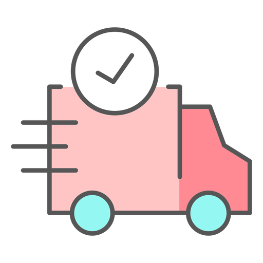

<?php
session_start();
include("db.php"); // Ensure this file points to 'joen_beauti'

$count = 0;
$username = "";

if (isset($_SESSION['user_id'])) {
    $uid = $_SESSION['user_id'];

    // Get total cart items
    $cartQuery = "SELECT SUM(quantity) AS total FROM cart WHERE user_id='$uid'";
    $cartResult = $conn->query($cartQuery);
    if ($cartResult) {
        $cartData = $cartResult->fetch_assoc();
        $count = $cartData['total'] ?? 0;
    }

    // Get username
    $userQuery = "SELECT username FROM users WHERE id='$uid'";
    $userResult = $conn->query($userQuery);
    if ($userResult) {
        $userData = $userResult->fetch_assoc();
        $username = $userData['username'] ?? "";
    }
}
?>

<!DOCTYPE html>
<html lang="en">
<head>
    <meta charset="UTF-8">
    <meta name="viewport" content="width=device-width, initial-scale=1.0">
    <title>JOEN_SHOP</title>

    <link rel="icon" type="image/png" href="joen_logo.png">
    <link href="https://cdn.jsdelivr.net/npm/bootstrap@5.3.0/dist/css/bootstrap.min.css" rel="stylesheet">
    <link rel="stylesheet" href="card.css">

    
</head>

<body>

<!-- NAVBAR -->
<nav class="custom-nav">
    

        
    

    

        <a href="home.php" class="nav-link">Shop</a>
        <a href="about.php" class="nav-link">About</a>
        <a href="contact.php" class="nav-link">Contact</a>
    

    

        <?php if(isset($_SESSION['user_id'])): ?>

    
        Hi, <?php echo htmlspecialchars($username); ?>
    

    <a href="logout.php" class="nav-link">
        Logout
    </a>

<?php else: ?>

   

<?php endif; ?>
        <?php if($username): ?>
            Hi, <?php echo htmlspecialchars($username); ?>
        <?php endif; ?>
        
       

        <a href="card.php" class="cart-box">
            
            <?php if($count > 0): ?>
                <?php echo $count; ?>
            <?php endif; ?>
        </a>
    

</nav>

<!-- PRODUCT GRID -->

    

        <?php
        // Fetch products from 'joen_beauti' database
        $sql = "SELECT * FROM products";
        $result = $conn->query($sql);

        if ($result && $result->num_rows > 0) {
            while($row = $result->fetch_assoc()) {
                // Ensure variables match your database column names
                $p_id    = $row['id'];
                $p_name  = $row['name'];
                $p_price = $row['price'];
                $p_desc  = $row['description'];
                $p_img   = $row['image'];
                ?>
                

                    

                        " class="product-image w-100 rounded-3 mb-3" alt="<?php echo $p_name; ?>">
                        
                        

                            

                                <h6 class="product-title m-0 fw-bold"><?php echo $p_name; ?></h6>
                                $<?php echo number_format($p_price, 2); ?>
                            

                            
<?php echo $p_desc; ?>

                            <a href="add_to_cart.php?id=<?php echo $p_id; ?>" class="btn btn-outline-dark w-100 rounded-pill d-flex align-items-center justify-content-center gap-2">
                                <svg xmlns="http://www.w3.org/2000/svg" width="16" height="16" fill="currentColor" class="bi bi-cart-plus" viewBox="0 0 16 16">
                                  <path d="M9 5.5a.5.5 0 0 0-1 0V7H6.5a.5.5 0 0 0 0 1H8v1.5a.5.5 0 0 0 1 0V8h1.5a.5.5 0 0 0 0-1H9V5.5z"/>
                                  <path d="M.5 1a.5.5 0 0 0 0 1h1.11l.401 1.607 1.498 7.985A.5.5 0 0 0 4 12h1a2 2 0 1 0 0 4 2 2 0 0 0 0-4h7a2 2 0 1 0 0 4 2 2 0 0 0 0-4h1a.5.5 0 0 0 .491-.408l1.5-8A.5.5 0 0 0 14.5 2H2.89l-.405-1.621A.5.5 0 0 0 2 1H.5zm3.915 10L3.102 4h10.796l-1.313 7h-8.17zM6 14a1 1 0 1 1-2 0 1 1 0 0 1 2 0zm7 0a1 1 0 1 1-2 0 1 1 0 0 1 2 0z"/>
                                </svg>
                                Add to Cart
                            </a>
                        

                    

                

                
                <?php
            }
        } else {
            echo "

No products available right now.

";
        }
        ?>
    

<!-- FOOTER -->
<footer class="footer-section mt-5">
    

        

            <!-- Branding/About -->
            

                <h5 class="fw-bold mb-3">JOEN BEAUTI</h5>
                
Curated premium skincare and beauty essentials from global brands. Quality care for your skin, delivered with passion.

                

                    
                    
                

            

            <!-- Shop Links -->
            

                <h6 class="fw-bold mb-3">Shop</h6>
                <ul class="list-unstyled footer-links">
                    <li><a href="home.php">All products</a></li>
                    <li><a href="category.php?type=cleanser">Cleansers</a></li>
                    <li><a href="category.php?type=serum">Serums</a></li>
                    <li><a href="category.php?type=sunscreen">Sunscreen</a></li>
                </ul>
            

            <!-- Company Links -->
            

                <h6 class="fw-bold mb-3">Company</h6>
                <ul class="list-unstyled footer-links">
                    <li><a href="about.php">About us</a></li>
                    <li><a href="contact.php">Contact</a></li>
                    <li><a href="#">Shipping policy</a></li>
                    <li><a href="#">Returns policy</a></li>
                </ul>
            

            <!-- Newsletter or Contact info -->
            

                <h6 class="fw-bold mb-3">Connect</h6>
                
Join our community for skin tips and new arrivals.

                

                    <input type="text" class="form-control form-control-sm border-0" placeholder="Email address">
                    <button class="btn btn-dark btn-sm px-3" type="button">Join</button>
                

            

        

        

        

            

                
© 2026 JOEN BEAUTI. All rights reserved.

            

        

    

</footer>

</body>
</html>
<?php
session_start();
include("db.php");

$count = 0;
$username = "";

// Check login
if(isset($_SESSION['user_id'])){

    $uid = $_SESSION['user_id'];

    // Cart count
    $cartQuery = "SELECT SUM(quantity) AS total 
                  FROM cart 
                  WHERE user_id='$uid'";

    $cartResult = $conn->query($cartQuery);

    if($cartResult){
        $cartData = $cartResult->fetch_assoc();
        $count = $cartData['total'] ?? 0;
    }

    // Username
    $userQuery = "SELECT user_name 
                  FROM users 
                  WHERE id='$uid'";

    $userResult = $conn->query($userQuery);

    if($userResult){
        $userData = $userResult->fetch_assoc();
        $username = $userData['user_name'] ?? "";
    }
}
?>

<!DOCTYPE html>
<html lang="en">
<head>

<meta charset="UTF-8">
<meta name="viewport" content="width=device-width, initial-scale=1.0">

<title>About Us | JOEN BEAUTI</title>

<link rel="icon" type="image/png" href="joen_logo.png">

<link href="https://cdn.jsdelivr.net/npm/bootstrap@5.3.0/dist/css/bootstrap.min.css" rel="stylesheet">

</head>

<body>

<!-- NAVBAR -->

<nav class="custom-nav">

    

        
    

    

        <a href="home.php" class="nav-link">Shop</a>
        <a href="about.php" class="nav-link">About</a>
        <a href="contact.php" class="nav-link">Contact</a>
    

    

        <?php if($username): ?>

            
                Hi, <?php echo htmlspecialchars($username); ?>
            

            <a href="logout.php" class="nav-link">
                Logout
            </a>

        <?php else: ?>

          

        <?php endif; ?>

        <a href="card.php" class="cart-box">
            

            <?php if($count > 0): ?>
                
                    <?php echo $count; ?>
                
            <?php endif; ?>
        </a>

    

</nav>

<!-- ABOUT HERO -->

    

        

            

                <h1 class="about-title mb-4">
                    About JOEN BEAUTI
                </h1>

                

                    JOEN BEAUTI is a modern skincare and beauty shop dedicated to helping people feel confident and beautiful every day.
                

                

                    We carefully select premium skincare products from trusted brands around the world. Our mission is to provide high-quality beauty essentials with elegant design, smooth shopping experience, and excellent customer care.
                

            

            

                

            

        

    

<!-- FEATURES -->

    

        <h2 class="fw-bold" style="font-size:40px;">
            Why Choose JOEN BEAUTI
        </h2>

        

            Experience premium skincare with elegance, quality, and care.
        

    

    

        <!-- CARD 1 -->

        

            

                

                    

                        

                    

                

                <h4 class="fw-bold mb-3">
                    Premium Products
                </h4>

                

                    Carefully selected skincare and beauty essentials from trusted international brands designed to nourish and protect your skin.
                

            

        

        <!-- CARD 2 -->

        

            

                

                    

                        

                    

                

                <h4 class="fw-bold mb-3">
                    Fast Delivery
                </h4>

                

                    Enjoy reliable and secure delivery services that bring your favorite beauty products directly to your doorstep quickly.
                

            

        

        <!-- CARD 3 -->

        

            

                

                    

                        

                    

                

                <h4 class="fw-bold mb-3">
                    Customer Care
                </h4>

                

                    Our friendly support team is always ready to help you with product recommendations and shopping assistance.
                

            

        

    

<!-- FOOTER -->

<footer class="footer-section mt-5">

    

        

            

                <h5 class="fw-bold mb-3">
                    JOEN BEAUTI
                </h5>

                

                    Elegant skincare and beauty shopping experience designed with care and passion.
                

            

            

                

                    © 2026 JOEN BEAUTI. All rights reserved.
                

            

        

    

</footer>

</body>
</html>
<?php
session_start();
include("db.php");

// Check product ID
if(!isset($_GET['id'])){
    header("Location: home.php");
    exit();
}

$product_id = intval($_GET['id']);

// If user not logged in
if(!isset($_SESSION['user_id'])){

    // Save product for later
    $_SESSION['redirect_product_id'] = $product_id;

    // Go login first
    header("Location: login.php");
    exit();
}

$user_id = $_SESSION['user_id'];

// Check existing item
$check = $conn->query("
    SELECT * FROM cart 
    WHERE user_id='$user_id' 
    AND product_id='$product_id'
");

if($check->num_rows > 0){

    // Increase quantity
    $conn->query("
        UPDATE cart 
        SET quantity = quantity + 1
        WHERE user_id='$user_id'
        AND product_id='$product_id'
    ");

}else{

    // Add new product
    $conn->query("
        INSERT INTO cart(user_id, product_id, quantity)
        VALUES('$user_id','$product_id',1)
    ");
}

header("Location: home.php");
exit();
?>
/* =======================
            PRODUCT CARDS
        ======================= */
        .product-grid {
            padding: 40px 30px;
        }

        .product-card {
            background: #fff;
            border: none;
            border-radius: 20px; /* Highly rounded corners */
            overflow: hidden;
            transition: transform 0.3s ease, box-shadow 0.3s ease;
            margin-bottom: 30px;
            height: 100%;
            box-shadow: 0 4px 15px rgba(0,0,0,0.05);
        }

        .product-card:hover {
            transform: translateY(-5px);
            box-shadow: 0 10px 25px rgba(0,0,0,0.1);
        }

        .product-image {
            width: 100%;
            height: 300px;
            object-fit: cover;
        }

        .product-info {
            padding: 20px;
        }

        .product-title {
            font-size: 1.2rem;
            font-weight: 700;
            margin-bottom: 5px;
            color: #1a1a1a;
        }

        .product-price {
            float: right;
            font-weight: 600;
            color: #1a1a1a;
        }

        .product-desc {
            font-size: 0.9rem;
            color: #777;
            margin-bottom: 20px;
            display: block;
        }

        .btn-add-cart {
            width: 100%;
            background: #f8f8f8;
            color: #1a1a1a;
            border: none;
            padding: 12px;
            border-radius: 12px;
            font-weight: 600;
            transition: 0.2s;
            display: flex;
            align-items: center;
            justify-content: center;
            gap: 8px;
            text-decoration: none;
        }

        .btn-add-cart:hover {
            background: #000;
            color: #fff;
        }

        /* Specific style for the dark button shown in your image */
        .btn-dark-custom {
            background: #1a1a1a;
            color: #fff;
        }
<?php
session_start();
include("db.php");

$count = 0;
$username = "";

// Check login
if(isset($_SESSION['user_id'])){

    $uid = $_SESSION['user_id'];

    // Cart count
    $cartQuery = "SELECT SUM(quantity) AS total 
                  FROM cart 
                  WHERE user_id='$uid'";

    $cartResult = $conn->query($cartQuery);

    if($cartResult){
        $cartData = $cartResult->fetch_assoc();
        $count = $cartData['total'] ?? 0;
    }

    // Username
    $userQuery = "SELECT user_name 
                  FROM users 
                  WHERE id='$uid'";

    $userResult = $conn->query($userQuery);

    if($userResult){
        $userData = $userResult->fetch_assoc();
        $username = $userData['user_name'] ?? "";
    }
}
?>

<!DOCTYPE html>
<html lang="en">

<head>

<meta charset="UTF-8">
<meta name="viewport" content="width=device-width, initial-scale=1.0">

<title>Contact | JOEN BEAUTI</title>

<link rel="icon" type="image/png" href="joen_logo.png">

<link href="https://cdn.jsdelivr.net/npm/bootstrap@5.3.0/dist/css/bootstrap.min.css" rel="stylesheet">

</head>

<body>

<!-- NAVBAR -->

<nav class="custom-nav">

    

        
    

    

        <a href="index.php" class="nav-link">Shop</a>
        <a href="about.php" class="nav-link">About</a>
        <a href="contact.php" class="nav-link">Contact</a>
    

    

        <?php if($username): ?>

            
                Hi, <?php echo htmlspecialchars($username); ?>
            

            <a href="logout.php" class="nav-link">
                Logout
            </a>

        <?php else: ?>

            

        <?php endif; ?>

        <a href="card.php" class="cart-box">

            

            <?php if($count > 0): ?>

                
                    <?php echo $count; ?>
                

            <?php endif; ?>

        </a>

    

</nav>

<!-- CONTACT SECTION -->

    

        

            <!-- LEFT -->

            

                <h1 class="contact-title mb-4">
                    Contact Us
                </h1>

                

                    We'd love to hear from you. Whether you have a question about products, delivery, or skincare recommendations, our team is ready to help.
                

                

                    

                        

                             
                             Address
                        

                        

                            Phnom Penh, Cambodia
                        

                    

                    

                        

                              Phone
                        

                        

                            +855 86 94 66 76
                        

                    

                    

                        

                              Email
                        

                        

                            support@joenbeauti.com
                        

                    

                    

                        

                              Working Hours
                        

                        

                            Monday - Sunday : 8AM - 9PM
                        

                    

                

            

            <!-- RIGHT -->

            

                <form>

                    

                        

                            <input type="text"
                                   class="form-control"
                                   placeholder="Your Name">

                        

                        

                            <input type="email"
                                   class="form-control"
                                   placeholder="Email Address">

                        

                        

                            <input type="text"
                                   class="form-control"
                                   placeholder="Subject">

                        

                        

                            <textarea class="form-control"
                                      rows="6"
                                      placeholder="Write your message..."></textarea>

                        

                        

                            <button class="send-btn w-100">
                                Send Message
                            </button>

                        

                    

                </form>

            

        

    

<!-- FOOTER -->

<footer class="footer-section mt-5">

    

        

            

                <h5 class="fw-bold mb-3">
                    JOEN BEAUTI
                </h5>

                

                    Elegant skincare and beauty shopping experience designed with care and passion.
                

            

            

                

                    © 2026 JOEN BEAUTI. All rights reserved.
                

            

        

    

</footer>

</body>
</html>
<?php
$conn = new mysqli("localhost", "root", "", "joen_beauti");

if ($conn->connect_error) {
    die("Connection failed: " . $conn->connect_error);
}

?>
<?php
session_start();
include("db.php");

$error = "";

if($_SERVER["REQUEST_METHOD"] == "POST"){

    $email = $_POST['email'];
    $password = $_POST['password'];

   $sql = "SELECT * FROM users WHERE email='$email'";
    $result = $conn->query($sql);

    if($result->num_rows > 0){

        $user = $result->fetch_assoc();

        // Check password
        if($password == $user['password']){

            $_SESSION['user_id'] = $user['id'];
            $_SESSION['username'] = $user['user_name'];

            // Return to cart
            if(isset($_SESSION['redirect_product_id'])){

                $pid = $_SESSION['redirect_product_id'];

                unset($_SESSION['redirect_product_id']);

                header("Location: add_to_cart.php?id=$pid");
                exit();
            }

            header("Location: home.php");
            exit();

        }else{
            $error = "Wrong password";
        }

    }else{
        $error = "Email not found";
    }
}
?>

<!DOCTYPE html>
<html>
<head>

<title>Login</title>

<link href="https://cdn.jsdelivr.net/npm/bootstrap@5.3.0/dist/css/bootstrap.min.css" rel="stylesheet">

</head>
<body>

    <h3 class="text-center mb-4">Login</h3>

    <?php if($error): ?>
        

            <?php echo $error; ?>
        

    <?php endif; ?>

    <form method="POST">

        

            <label>Email</label>
            <input type="email" name="email" class="form-control" required>
        

        

            <label>Password</label>
            <input type="password" name="password" class="form-control" required>
        

        <button class="btn btn-dark w-100">
            Login
        </button>

    </form>

</body>
</html>
